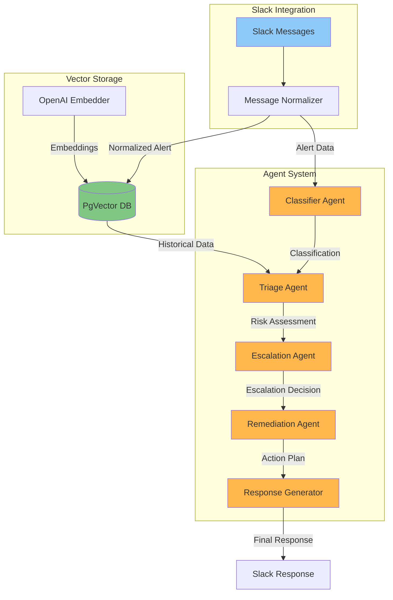
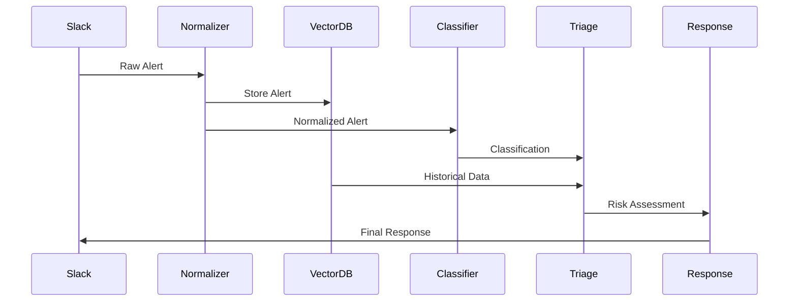
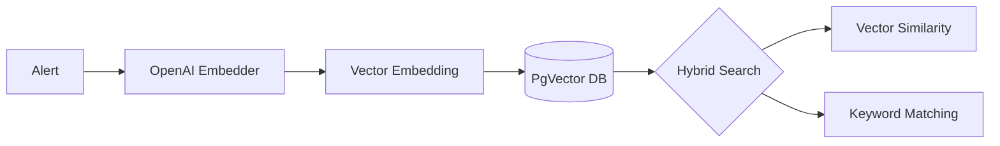
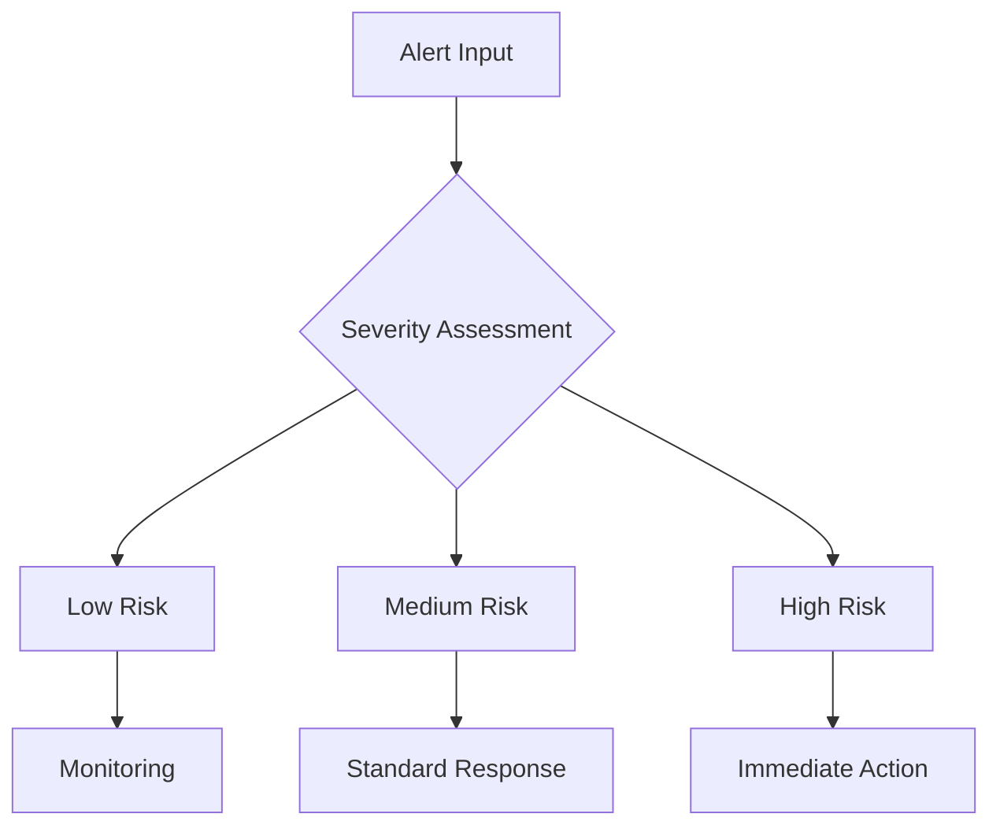

# Slack Security Alert Triage System

Eliminate alert fatigue and streamline security operations with our advanced AI-powered auto-triage system. By leveraging multiple specialized autonomous agents, this system automatically processes, analyzes, and responds to security alerts 24/7, reducing manual intervention by up to 80%. Transform your security operations from reactive to proactive while your team focuses on strategic initiatives rather than routine alert management.

There are two scripts `
1. Auto-Triage Slack alerts using RAG
2. Agentic Auto Triage using RAG.  [https://github.com/shadsidd/Agentic-AI-Slack-AutoTriage/blob/master/README_AGENTIC_V2.md]

This is RAG-based Auto Triage ReadMe 

## System Architecture



## Alert Processing Flow



## Core Features

### 1. Smart Alert Processing
- Normalizes diverse Slack security alerts into a consistent format
- Extracts key information using pattern matching
- Supports multiple alert types
- Automatically identifies threat types and severity levels

### 2. VectorDB Integration


### 3. Multi-Agent System
The system uses specialized agents for different aspects of alert processing:

#### Classifier Agent
```python
# Classification Categories
ALERT_TYPES = {
    "Phishing": "Attempts to deceive users",
    "Malware": "System harm or data theft",
    "Unusual Login": "Suspicious authentication",
    "Credential Compromise": "Stolen credentials",
    "Network Attack": "Port scanning, brute force",
    "Other": "Uncategorized security issues"
}
```

#### Triage Agent


#### Alert Normalization Structure
```yaml
Alert Format:
  - alert_type: Type of security alert
  - title: Alert title
  - description: Detailed description
  - metadata:
      - account: Affected account
      - region: AWS region
      - instance: Instance ID
      - source_ip: Source IP address
      - severity: Alert severity
      - mfa_used: MFA status
      - timestamp: Alert time
      - threat_details: Specific threat info
```

## Output

## Setup Requirements

### Dependencies
- Python 3.8+
- PostgreSQL with pgvector extension
- Agno framework
- OpenAI API access

### Environment Setup
```bash
# Database URL format
postgresql+psycopg://ai:ai@localhost:5532/ai

# Required environment variables
OPENAI_API_KEY=your_key_here
SLACK_BOT_TOKEN=your_token_here
```

## Usage

```bash
python slack_autotriage.py
```

