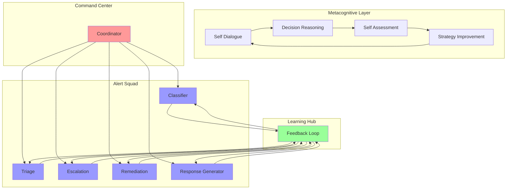
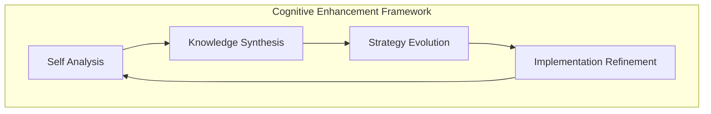
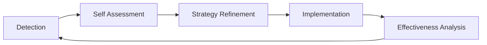

# Slack Auto-triage Agentic System

Eliminate alert fatigue and streamline security operations with our advanced AI-powered auto-triage system. By leveraging multiple specialized autonomous agents, this system automatically processes, analyzes, and responds to security alerts 24/7, reducing manual intervention by up to 80%. Transform your security operations from reactive to proactive while your team focuses on strategic initiatives rather than routine alert management.

## Autonomous Decision Intelligence

The system employs advanced agentic AI capabilities, enabling autonomous decision-making through sophisticated self-dialogue and recursive improvement. Each agent maintains an internal monologue to reason about decisions, challenge its own assumptions, and continuously refine its responses. This metacognitive approach ensures high-quality, contextually appropriate actions without human intervention.

### Strategic Coordinator
The central orchestration agent that manages workflow distribution, monitors system performance, and ensures optimal resource utilization across all specialized agents. Through internal reasoning and dynamic priority assessment, it makes real-time decisions about resource allocation and workflow optimization.

### Specialized Agents Network
- **Classification Agent**: Performs initial alert analysis and categorization using advanced pattern recognition, engaging in self-dialogue to validate classification decisions
- **Triage Agent**: Conducts comprehensive risk assessment through recursive analysis and self-questioning protocols
- **Escalation Agent**: Implements intelligent escalation protocols based on internal deliberation and context evaluation
- **Remediation Agent**: Develops and executes automated response strategies through systematic solution exploration
- **Response Generation Agent**: Produces standardized documentation while self-reviewing for clarity and completeness

## Agentic Learning Architecture



## Advanced Learning Capabilities

Our system implements sophisticated machine learning mechanisms with metacognitive abilities:

1. **Self-Dialogue Learning**: Agents engage in internal reasoning to validate and improve decisions
2. **Inter-agent Knowledge Transfer**: Sophisticated feedback mechanisms enabling cross-functional learning
3. **Recursive Improvement**: Continuous self-assessment and strategy refinement through internal dialogue
4. **Dynamic Response Optimization**: Automated refinement of response strategies based on self-critique

## Autonomous Decision Process

1. **Initial Analysis Phase**
   - Self-guided alert classification and contextualization
   - Internal dialogue for pattern validation
   - Recursive analysis for confidence assessment

2. **Risk Assessment Protocol**
   - Multi-step internal reasoning for threat evaluation
   - Self-questioning for impact analysis
   - Autonomous risk scoring with confidence metrics

3. **Response Implementation**
   - Self-validated remediation procedures
   - Internal review of response effectiveness
   - Autonomous stakeholder communication decisions

## Agentic Learning Framework

Example of agent self-dialogue:

```yaml
Internal Decision Process:
  Alert Analysis:
     Agent Internal Dialogue:
        - "Analyzing login pattern... Multiple failed attempts detected"
        - "Comparing against known attack signatures..."
        - "High confidence (92%) this matches brute force pattern"
        - "Should I escalate immediately? Checking additional context..."
        - "Recent similar attempts from same subnet - confirming threat assessment"
     Final Decision:
        - Classification: "Confirmed Brute Force Attack"
        - Action: "Immediate IP Block + Security Team Notification"
        - Reasoning: "Pattern matches known attack vectors with high confidence"
```

## Knowledge Evolution System



## Performance Self-Optimization



## Autonomous Learning Metrics

- Self-improvement rate through internal dialogue
- Decision confidence scoring
- Strategy adaptation frequency
- Response effectiveness self-assessment
- Cross-agent knowledge transfer efficiency